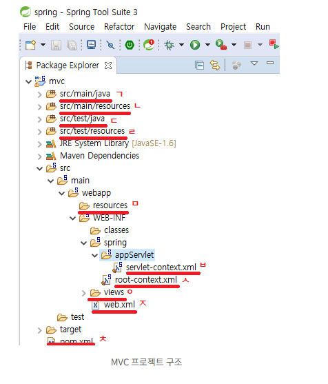

ㄱ.  작성되는 코드의 경로

ㄴ. 실행할 때 참고하는 기본 경로(주로 설정 파일)

ㄷ. 테스트 코드를 넣는 경로

ㄹ. 테스트 관련 설정 파일 보관 경로

ㅁ. 뷰에서 참고로 할 js,css파일

ㅂ. 웹과 관련된 스프링 설정 파일

ㅅ. 스프링 설정 파일

ㅇ. 템플릿 프로젝트의 jsp 파일 경로

ㅈ. Tomcat의 web.xml 파일

ㅊ. Maven이 사용하는 pom.xml

0422 : 초기설정 및 데이터베이스 연결, 테스트 , 깃허브 연동

